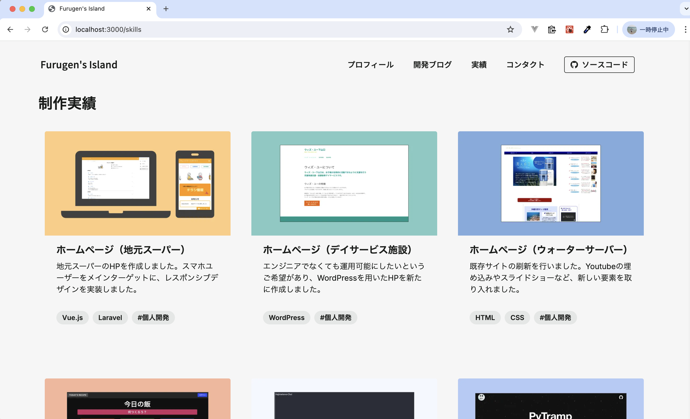
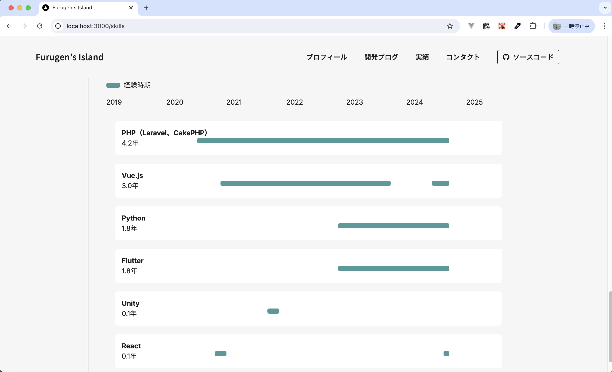
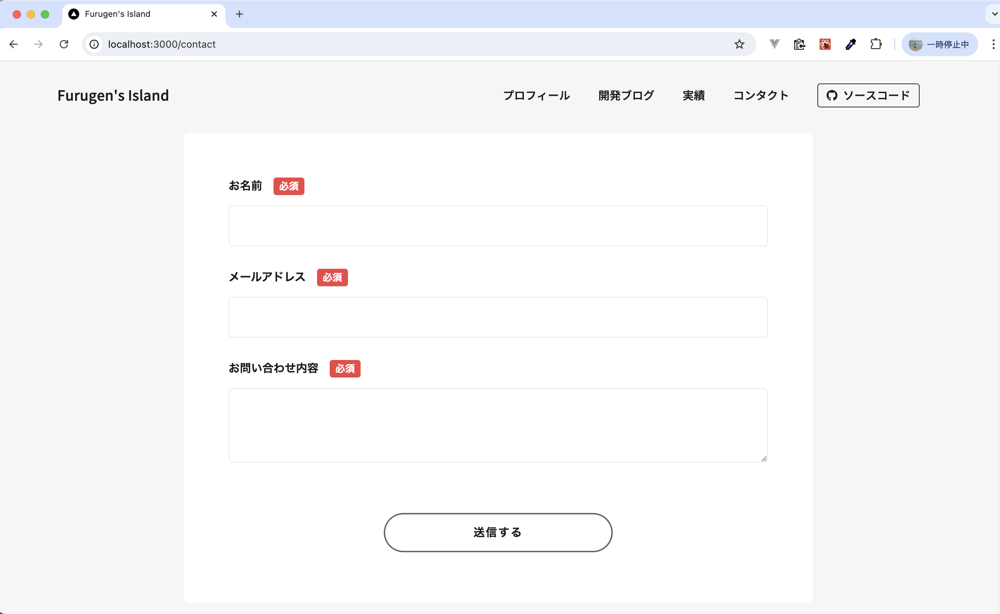
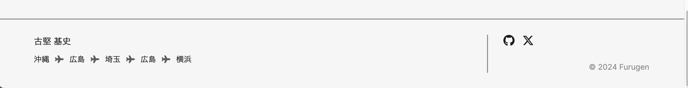
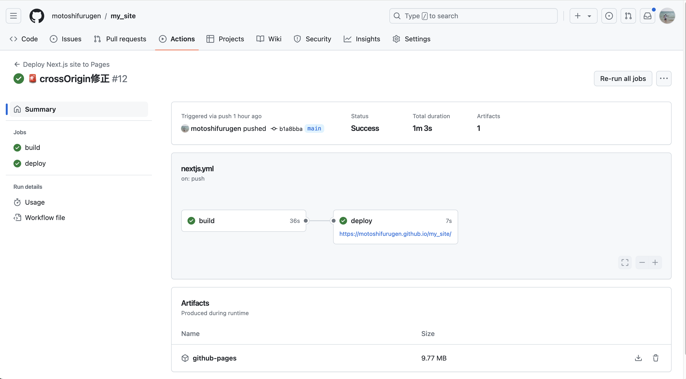
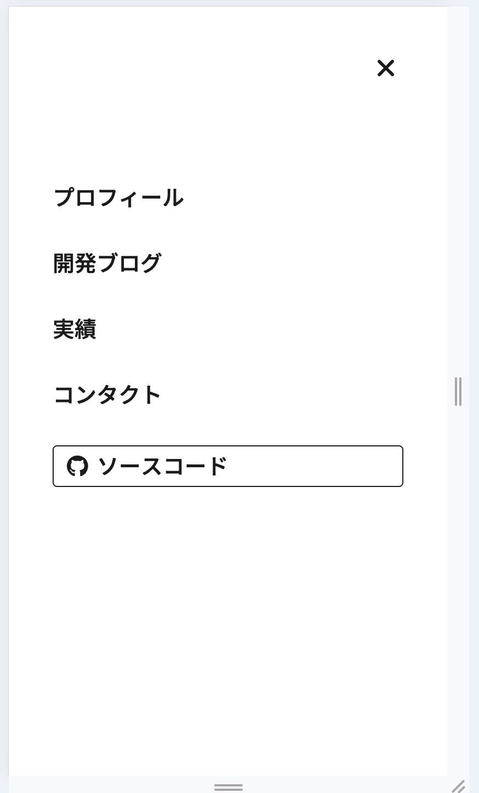
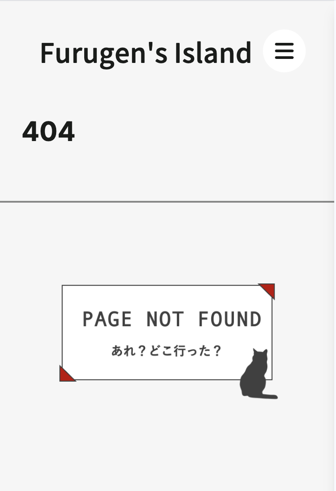
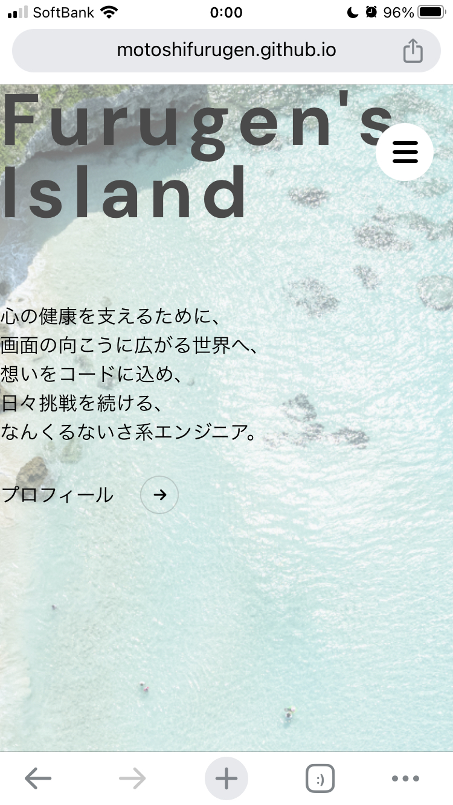
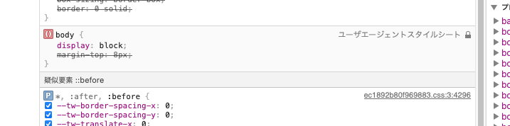

# Next.jsで開発ブログ付きのポートフォリオサイトを作成したい 🚀

| 利用環境                                      | バージョン              |
| --------------------------------------------- | ----------------------- |
| macOS                                         | Sonoma 14.5（M1チップ） |
| Node.js                                       | 20.12.2                 |
| [React](https://ja.react.dev/)                | 18                      |
| [Next.js](https://nextjs.org/)                | 14.2.5                  |
| [TypeScript](https://www.typescriptlang.org/) | 5                       |
| [tailwindcss](https://tailwindcss.com/)       | 3.4.1                   |

## 開発ブログはこちら

https://furugen-island.com/my_site/blog/create_my_site

https://furugen-island.com/my_site/blog/create_my_site_2

## 実績ページの作成

実績サイト記載用のカードコンポーネントで型を作成する。

`components/WorkCard.tsx`←新たに追加

```javascript
import Image from "next/image";

interface WorkCardProps {
  src: string;
  alt: string;
  title: string;
  description: string;
  tags: string[];
}

const WorkCard: React.FC<WorkCardProps> = ({ src, alt, title, description, tags }) => {
  return (
    <div className="max-w-sm rounded overflow-hidden mb-20">
      <Image src={src} alt={alt} width={500} height={500} className="w-full" />
      <div className="px-6 py-4">
        <div className="font-bold text-xl mb-2">{title}</div>
        <p className="text-gray-700 text-base">{description}</p>
      </div>
      <div className="px-6 pt-4 pb-2">
        {tags.map((tag, index) => (
          <span key={index} className="inline-block bg-gray rounded-full px-3 py-1 text-sm font-semibold mr-2 mb-2">
            {tag}
          </span>
        ))}
      </div>
    </div>
  );
};

export default WorkCard;
```

実績画面内でmapを用いてコンポーネントを利用する。

`works/page.tsx`←新たに作成

```javascript
<div className="works px-20">
  <h2 className="text-3xl font-bold">制作実績</h2>
  <div className="work-list grid grid-cols-3 gap-4 justify-items-center items-center my-10">
    {works.map((work, index) => (
      <WorkCard
        key={index}
        src={work.src}
        alt={work.alt}
        title={work.title}
        description={work.description}
        tags={work.tags}
      />
    ))}
  </div>
</div>
```



## スキルを表示する

タイムライン型のスキルマップを作成したい。検索してもヒットしなかったので、ChatGPTに聞く。

> Next.jsを利用したポートフォリオサイトを開発しています。
> スキル掲載画面にて、各技術に対する経験年数を、タイムライン型のスキルマップグラフで表示させたいです。
> 学びには中断時期があるため、マップのバーが途切れる箇所があることなども想定してください。
> 例えば、PHP歴３年（2021年〜2024年）、Vue.js歴2年（2020年〜2021年、2023年~2024年）といったデータを用います。
> jsxとTypescript形式で教えてください。また、可能であればCSSをTailWindcssで置き換えてください。

もらったコードを微調整して、タイムラインチャートを作成

`components/SkillTimeline.tsx`←新たに追加

```javascript
const SkillTimeline: React.FC = () => {
  const totalYears = max - 2019 + 1; // グラフの長さ（2024年8月現在は6.6）
  const sortedSkills = skills.sort((a, b) => b.total - a.total);
  const years = Array.from({ length: Math.ceil(totalYears) }, (_, i) => 2019 + i);

  return (
    <div className="w-4/5 mx-auto p-10 border-l-4 border-gray relative my-10">
      <div className="flex items-center">
        <div className="bg-teal bg-opacity-80 h-3 rounded w-8"></div>
        <p className="ml-2">経験時期</p>
      </div>
      <div className="relative mb-10 py-4">
        {years.map((year, index) => {
          const left = ((year - 2019) / totalYears) * 100;
          return (
            <span
              key={index}
              className="absolute text-md"
              style={{ left: `${left}%`}}
            >
              {year}
            </span>
          );
        })}
      </div>
      {sortedSkills.map((skill, index) => (
        <div key={index} className="mb-5 pl-5 relative">
          <div className="bg-white p-4 rounded-lg relative">
            <h3 className="font-bold">{skill.name}</h3>
            <div className="flex">
              {skill.total.toFixed(1)}年
              {skill.periods.map((period, i) => {
                const startOffset = ((period.start - 2019) / totalYears) * 100;
                const width = ((period.end - period.start + 0.1) / totalYears) * 100;
                return (
                  <div
                    key={i}
                    className="absolute bg-teal bg-opacity-80 h-3 rounded"
                    style={{
                      left: `${startOffset}%`,
                      width: `${width}%`
                    }}
                  ></div>
                );
              })}
            </div>
          </div>
        </div>
      ))}
    </div>
  );
};

export default SkillTimeline;
```



## コンタクト画面作成

今回は以下のサイトのフォームを利用してみる。

- [メールフォームサービス/API/ASP/Saas | SSGform](https://ssgform.com/)



## フッターを作成

アニメーションのついた横棒（`PageFace.tsx`で使用）をfooterでも使いたいので、コンポーネント化する

`components/AnimatedLine.tsx`←新たに作成

```javascript
import React, { useEffect, useRef } from 'react';

const AnimatedLine: React.FC = () => {
  const lineRef = useRef<HTMLDivElement>(null);

  useEffect(() => {
    if (lineRef.current) {
      lineRef.current.classList.remove('w-0');
      lineRef.current.classList.add('w-full');
    }
  }, []);

  return (
    <div
      ref={lineRef}
      className="h-0.5 opacity-50 bg-font-main transition-all duration-1000 ease-in-out w-0 mt-4"
    ></div>
  );
};

export default AnimatedLine;
```

フッターコンポーネント作成

`components/Footer.tsx`←新たに作成

```javascript
'use client'

import { FontAwesomeIcon } from '@fortawesome/react-fontawesome'
import { faPlane } from '@fortawesome/free-solid-svg-icons'
import { faGithub, faXTwitter } from '@fortawesome/free-brands-svg-icons'
import AnimatedLine from './AnimatedLine'

export default function Footer() {
  return (
    <>
      <AnimatedLine />
      <footer className="p-2 mt-auto">
        <div className="container mx-auto flex h-32 py-6">
          <div className="rightFooter w-3/4">
            <p className="mb-3 text-lg">古堅 基史</p>
            <p>
              沖縄
              <FontAwesomeIcon icon={faPlane} className="mx-3 opacity-70" />
              広島
              <FontAwesomeIcon icon={faPlane} className="mx-3 opacity-70" />
              埼玉
              <FontAwesomeIcon icon={faPlane} className="mx-3 opacity-70" />
              広島
              <FontAwesomeIcon icon={faPlane} className="mx-3 opacity-70" />
              横浜
            </p>
          </div>
          <div className="border-l-2 opacity-50 mx-8"></div>
          <div className="leftFooter w-1/4 flex flex-col justify-between">
            <div className="flex space-x-4">
              <a
                href="https://github.com/motoshifurugen"
                target="_blank"
                rel="noopener noreferrer"
              >
                <FontAwesomeIcon icon={faGithub} className="text-2xl" />
              </a>
              <a
                href="https://x.com/cocoahearts21"
                target="_blank"
                rel="noopener noreferrer"
              >
                <FontAwesomeIcon icon={faXTwitter} className="text-2xl" />
              </a>
            </div>
            <p className="self-end opacity-50">&copy; 2024 Furugen</p>
          </div>
        </div>
      </footer>
    </>
  )
}
```

`layout.tsx`でフッターを利用する。

```javascript
<html lang="ja">
  <body className={inter.className}>
    <BackgroundWrapper>
      <Header />
      <main className="pt-40">{children}</main>
    </BackgroundWrapper>
    <Footer />
  </body>
</html>
```



## github pagesにて公開

- [Next.js 14.1 を GitHub Pages にデプロイするガイド](https://zenn.dev/kazzyfrog/articles/8e24dfe951aad9)

path関連でたくさんエラー出たので、以下のように修正

```javascript
(-) const isRootPath = pathname === '/';
(+) const isRootPath = pathname === `${BASE_PATH}/` || pathname === "/";
```

デプロイ成功!



### https://motoshifurugen.github.io/my_site/ で公開された🙌

## レスポンシブ対応

ヘッダーメニューをレスポンシブ対応（ハンバーガーメニュー追加）する

`components/Header.tsx`

```javascript
<header
  className={`
			fixed top-0 left-0 w-full z-50
			py-3 mb-20 px-8
			${!isMainPage ? 'bg-bg-main' : 'bg-transparent'}
		`}
>
  <div className="container mx-auto flex flex-wrap py-5 flex-col md:flex-row items-center">
    <div className="container mx-auto flex z-50">
      {!isMainPage && (
        <a href={`${BASE_PATH}/`} className="flex font-mobo my-2 md:mb-0">
          <span className="ml-3 text-3xl md:text-xl">
            Furugen&apos;s Island
          </span>
        </a>
      )}
      <button
        className="md:hidden ml-auto text-2xl bg-white rounded-full w-12 h-12 flex items-center justify-center"
        onClick={toggleMenu}
      >
        <FontAwesomeIcon icon={menuOpen ? faTimes : faBars} />
      </button>
    </div>
    <nav
      className={`
				  flex flex-wrap flex-col md:flex-row
					item-left md:items-center text-base md:justify-center
					font-mobo
				  fixed top-0 right-0 h-full bg-white shadow-lg transform transition-transform duration-300 ease-in-out
				  ${menuOpen ? 'translate-x-0' : 'translate-x-full'}
				  md:relative md:translate-x-0 md:bg-transparent md:shadow-none
					md:ml-auto
					w-full md:w-auto
					pt-40 px-10 md:py-0 md:px-0 md:bg-transparent
				`}
    >
      <Link
        className="mb-8 md:mb-0 md:mr-10 text-xl md:text-base hover:opacity-50"
        href="/profile"
      >
        プロフィール
      </Link>
      <Link
        className="mb-8 md:mb-0 md:mr-10 text-xl md:text-base hover:opacity-50"
        href="/blog"
      >
        開発ブログ
      </Link>
      <Link
        className="mb-8 md:mb-0 md:mr-10 text-xl md:text-base hover:opacity-50"
        href="/skills"
      >
        実績
      </Link>
      <Link
        className="mb-8 md:mb-0 md:mr-10 text-xl md:text-base hover:opacity-50"
        href="/contact"
      >
        コンタクト
      </Link>
      <Link
        className="mb-8 md:mb-0 md:mr-10 text-xl md:text-base hover:bg-gray"
        href="https://github.com/motoshifurugen/my_site"
        target="_blank"
        rel="noopener noreferrer"
      >
        <div className="flex items-center border border-gray-300 rounded px-3 py-1">
          <FontAwesomeIcon icon={faGithub} className="mr-2" />
          ソースコード
        </div>
      </Link>
    </nav>
  </div>
</header>
```



スタイルは`md`をつけるかつけないかで一つ一つやっているので汚い。効率化できないか。

同様に他ページもレスポンシブ対応する。

## Not Found用のページ作成

not found時に表示できる画面をカスタマイズできるらしい

`app/not-found.tsx`←新たに作成



## GoogleAnalytics導入

- [【Next.js】Next.js14でGoogleAnalytics（GA4）を導入する方法 | Neightbor. | あなたのビジネスをWEBで支える](https://neightbor.jp/blog/nextjs14-ga4)

## cssルール決め

- 上下方向の余白は「-top」を使用する。（上下方向は、できるだけy方向指定ではなくtopのみ指定を使う）
- メインカラーとして「main-white」「main-black」を用意して使用する。
- classNameの各順序は以下
  - 特殊なやつ（container、z-indexなど）
  - flex関係
  - 幅・高さ
  - アニメーション
- 意味を持たないクラスは当てない

## コンポーネント見直し

Atomic designを参考に、以下のフォルダにコンポーネントを分類する。

- atoms
- molecules
- organism
- templates

## iphoneでの表示がおかしい

PCではiphoneサイズでも乱れてなかったが、iphoneだとだめ
→global.cssが効いてなさそう？



devツールで確認する

- [【Safari】MacとiPhone 実機で開発者ツールを使う方法 #Safari - Qiita](https://qiita.com/yutomaeda5510/items/f78d60038e2af34f67f0)

なんか自分の設定が弾かれている



`!importtant`つけてみる

TODO: 原因要調査（他の実機では問題なく表示されていたため一旦保留）

## 技術ブログ作成

以下を参考に作成する

- [cmb-sy/blog at 205add321487d7b292cb272e27fd784831cec902](https://github.com/cmb-sy/blog/tree/205add321487d7b292cb272e27fd784831cec902)
- [【SSR、SSG、ISRでブログを作る】Nextjs14初心者入門](https://zenn.dev/y_ta/books/eec3b78567aeeb)

### To be continued... 🍻
