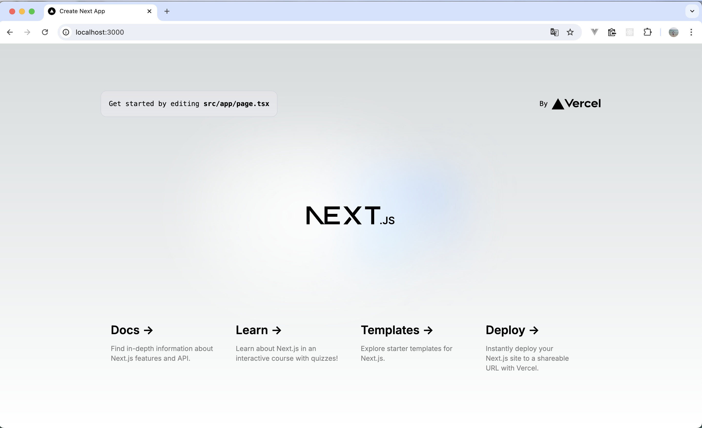
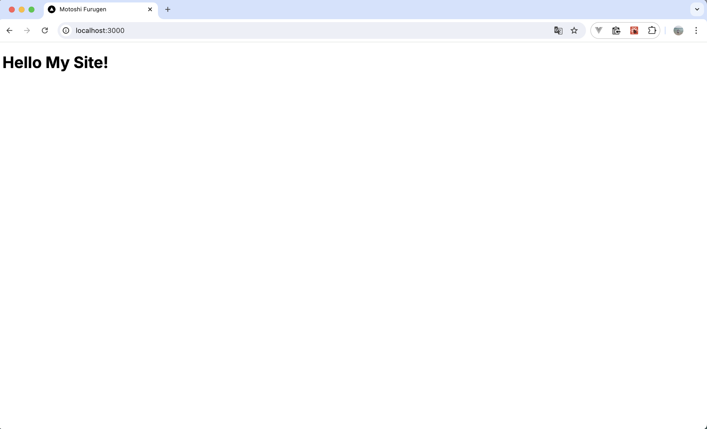
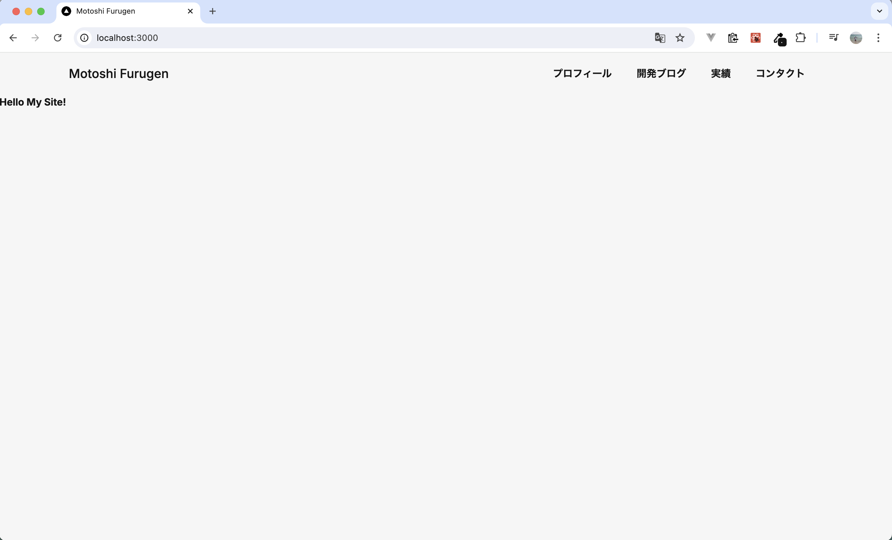
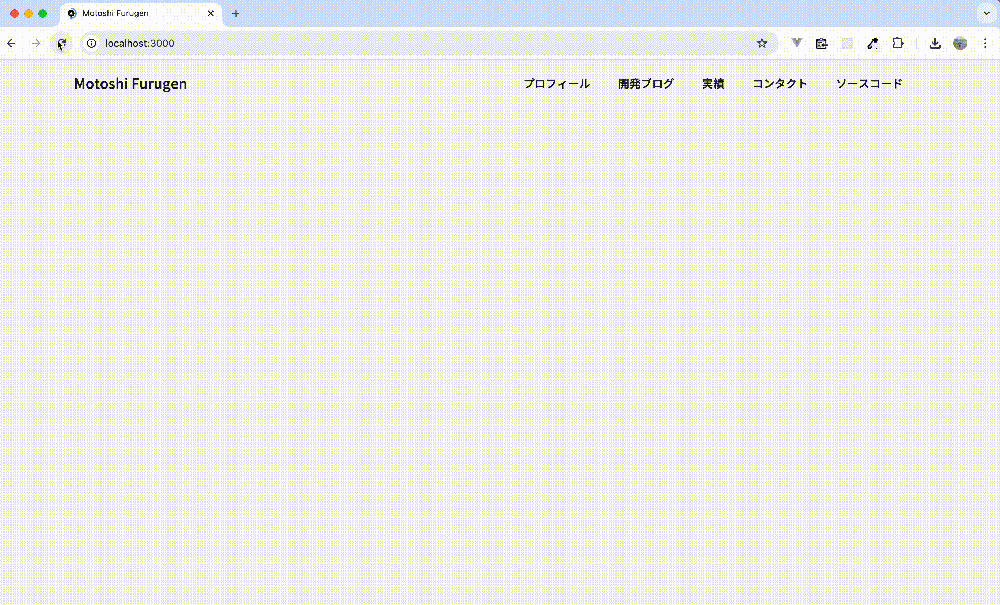

# Next.jsで開発ブログ付きのポートフォリオサイトを作成したい 🚀

| 利用環境                                      | バージョン              |
| --------------------------------------------- | ----------------------- |
| macOS                                         | Sonoma 14.5（M1チップ） |
| Node.js                                       | 20.12.2                 |
| [React](https://ja.react.dev/)                | 18                      |
| [Next.js](https://nextjs.org/)                | 14.2.5                  |
| [TypeScript](https://www.typescriptlang.org/) | 5                       |
| [tailwindcss](https://tailwindcss.com/)       | 3.4.1                   |

### デザインの参考にするサイト（完成イメージ）

- [TOP | 株式会社パズル](https://puzzle-inc.jp/)
- [szne](https://szn.jp/)

### キャッチアップ方法

- [【2024年最新】React(v18)完全入門ガイド｜Hooks、Next14、Redux、TypeScript | Udemy](https://www.udemy.com/course/react-complete-guide/?couponCode=KEEPLEARNING)

## Nextアプリ作成

```zsh
npx create-next-app@latest
```

```zsh
Need to install the following packages:
create-next-app@14.2.5
Ok to proceed? (y)
```

yを入力してエンター

好みで答える。
意味については [create-next-appで訊かれていること](https://zenn.dev/ikkik/articles/51d97ff70bd0da) を参考にしました。

```zsh
✔ What is your project named? … my-site
✔ Would you like to use TypeScript? … Yes
✔ Would you like to use ESLint? … Yes
✔ Would you like to use Tailwind CSS? … Yes
✔ Would you like to use `src/` directory? … Yes
✔ Would you like to use App Router? (recommended) … Yes
✔ Would you like to customize the default import alias (@/*)? … No
```

```zsh
cd my-site
npm run dev
```

http://localhost:3000/



いったん、page.tsxのreturn内とglobals.cssを削除した



## アプリ全体のデザインをglobal.cssに設定

`page.tsx`にtailwindをimport
```javascript
import 'tailwindcss/tailwind.css';

export default function Home() {
  return (
    <body>
      <h1>Hello My Site!</h1>
    </body>
  );
}
```

`tailwind.config.ts`

```javascript
import type { Config } from "tailwindcss";

const config: Config = {
  content: [
    "./src/pages/**/*.{js,ts,jsx,tsx,mdx}",
    "./src/components/**/*.{js,ts,jsx,tsx,mdx}",
    "./src/app/**/*.{js,ts,jsx,tsx,mdx}",
  ],
  theme: {
    colors: {
      'bg-main' : '#F6F6F6',
      'font-main' : '#161616',
    },
    fontFamily: {
      'ryo-gothic-plusn': ['"ryo-gothic-plusn"', 'sans-serif'],
    }
  },
  plugins: [],
};
export default config;
```

`globals.css`
```css
@tailwind base;
@tailwind components;
@tailwind utilities;

body {
  @apply bg-bg-main text-font-main font-ryo-gothic-plusn;
}
```

## Headerの作成

[Tailblocks — Ready-to-use Tailwind CSS blocks](https://tailblocks.cc/)

`components/Header.tsx`←新規作成

```javascript
import Link from "next/link"
import 'tailwindcss/tailwind.css';

const Header = () => {
	return (
		<header>
		  <div className="container mx-auto flex flex-wrap p-5 flex-col md:flex-row items-center">
		    <a className="flex font-medium items-center mb-4 md:mb-0">
		      <span className="ml-3 text-xl">Motoshi Furugen</span>
		    </a>
		    <nav className="md:ml-auto flex flex-wrap items-center text-base justify-center">
		      <Link className="mr-10 hover:opacity-50" href="#">プロフィール</Link>
		      <Link className="mr-10 hover:opacity-50" href="#">開発ブログ</Link>
		      <Link className="mr-10 hover:opacity-50" href="#">実績</Link>
		      <Link className="mr-10 hover:opacity-50" href="#">コンタクト</Link>
		    </nav>
		  </div>
		</header>
	)
}

export default Header
```

`layout.tsx`を変更
```javascript
import type { Metadata } from "next";
import { Inter } from "next/font/google";
import "./globals.css";

import Header from "./components/Header";

const inter = Inter({ subsets: ["latin"] });

export const metadata: Metadata = {
  title: "Motoshi Furugen",
  description: "This is Motoshi Furugen's personal website.",
};

export default function RootLayout({
  children,
}: Readonly<{
  children: React.ReactNode;
}>) {
  return (
    <html lang="en">
      <body className={inter.className}>
        <Header />
        {children}
      </body>
    </html>
  );
}
```



## テキストアニメーションの作成

```zsh
npm install gsap
```

`components/TitleAnimation.tsx`←新規作成
```javascript
"use client";

import { useEffect, useRef } from 'react';
import gsap from 'gsap';
import { TextPlugin } from 'gsap/TextPlugin';

gsap.registerPlugin(TextPlugin);

export default function TitleAnimation() {

  // 文字を一文字ずつ表示するアニメーション
  const textRef = useRef<HTMLParagraphElement>(null);
  useEffect(() => {
    if (textRef.current) {
      gsap.to(textRef.current, { duration: 1.75, text: "Furugen" });
    }
  }, []);

  return (
    <p
      className="
        w-full
        text-[8rem]
        text-left
        text-font-main
        font-dm-sans
        tracking-widest
        mx-[100px]
      "
      ref={textRef}
    ></p>
  );
}
```



## メインメッセージ部分作成

MainMessageコンポーネントにメッセージを書き、フォント・行間を調整する。

`components/MainMessage.txs`←新しく追加

[Line Height - Tailwind CSS](https://tailwindcss.com/docs/line-height)

```javascript
export default function MainMessage() {
  return (
    <>
      <p className="text-2xl leading-loose">
        心の健康を支えるために、<br />
        画面の向こうに広がる世界へ、<br />
        想いをコードに込め、<br />
        毎日挑戦し続ける、<br />
        なんくるないさ系エンジニア。
      </p>
    </>
  );
}
```

`page.tsx`にて、`TitleAnimation`コンポーネントと`MainMessage`コンポーネントを横並びにする。

`page.tsx`
```javascript
・・・
<section className="main-face flex">
  <div className="flex-1">
    <TitleAnimation />
  </div>
  <div className="w-[480px]">
    <MainMessage />
  </div>
</section>
・・・
```

### To be continued... 🍻