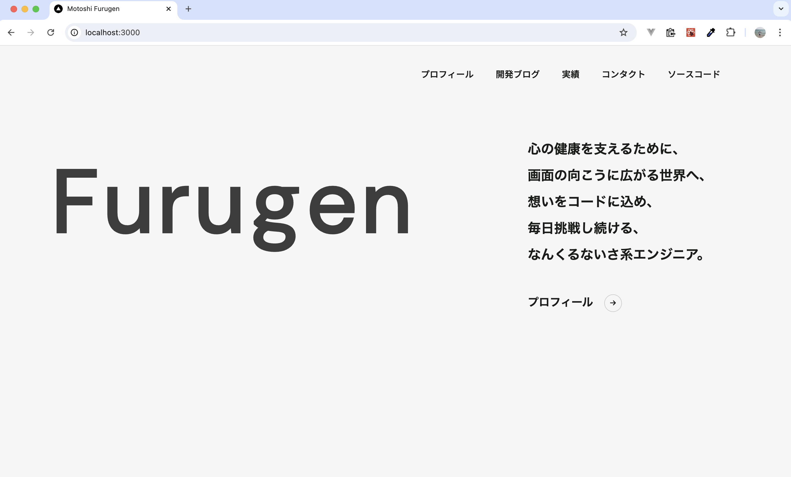
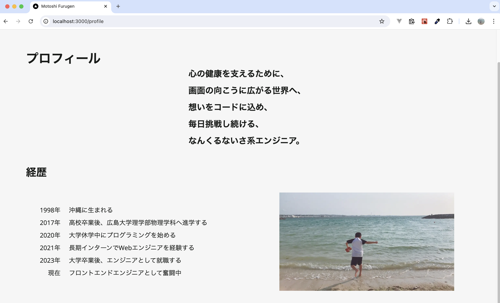
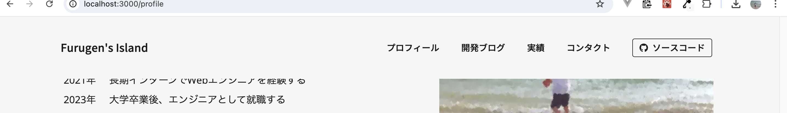
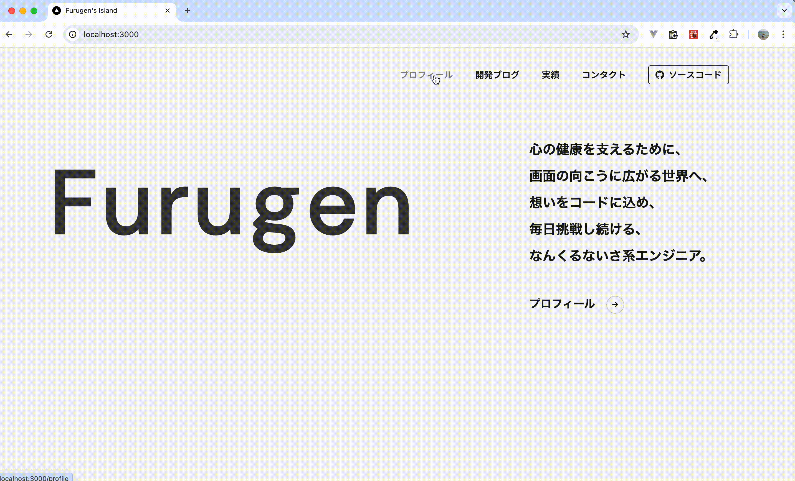

# Next.jsで開発ブログ付きのポートフォリオサイトを作成したい 🚀

| 利用環境                                      | バージョン              |
| --------------------------------------------- | ----------------------- |
| macOS                                         | Sonoma 14.5（M1チップ） |
| Node.js                                       | 20.12.2                 |
| [React](https://ja.react.dev/)                | 18                      |
| [Next.js](https://nextjs.org/)                | 14.2.5                  |
| [TypeScript](https://www.typescriptlang.org/) | 5                       |
| [tailwindcss](https://tailwindcss.com/)       | 3.4.1                   |

### デザインの参考にするサイト（完成イメージ）

- [TOP | 株式会社パズル](https://puzzle-inc.jp/)
- [szne](https://szn.jp/)

<!-- 上記サイトや適宜乗せている参考サイト、Github Copilotのおかげで、無事にポートフォリオが完成しました。本当にありがとうございます！ -->

### キャッチアップ方法

- [【2024年最新】React(v18)完全入門ガイド｜Hooks、Next14、Redux、TypeScript | Udemy](https://www.udemy.com/course/react-complete-guide/?couponCode=KEEPLEARNING)

## Nextアプリ作成

```zsh
npx create-next-app@latest
```

```zsh
Need to install the following packages:
create-next-app@14.2.5
Ok to proceed? (y)
```

yを入力してエンター

好みで答える。
意味については [create-next-appで訊かれていること](https://zenn.dev/ikkik/articles/51d97ff70bd0da) を参考にしました。

```zsh
✔ What is your project named? … my-site
✔ Would you like to use TypeScript? … Yes
✔ Would you like to use ESLint? … Yes
✔ Would you like to use Tailwind CSS? … Yes
✔ Would you like to use `src/` directory? … Yes
✔ Would you like to use App Router? (recommended) … Yes
✔ Would you like to customize the default import alias (@/*)? … No
```

```zsh
cd my-site
npm run dev
```

http://localhost:3000/


いったん、page.tsxのreturn内とglobals.cssを削除した


## アプリ全体のデザインをglobal.cssに設定

`page.tsx`にtailwindをimport

```javascript
import 'tailwindcss/tailwind.css'

export default function Home() {
  return (
    <body>
      <h1>Hello My Site!</h1>
    </body>
  )
}
```

`tailwind.config.ts`

```javascript
import type { Config } from "tailwindcss";

const config: Config = {
  content: [
    "./src/pages/**/*.{js,ts,jsx,tsx,mdx}",
    "./src/components/**/*.{js,ts,jsx,tsx,mdx}",
    "./src/app/**/*.{js,ts,jsx,tsx,mdx}",
  ],
  theme: {
    colors: {
      'bg-main' : '#F6F6F6',
      'font-main' : '#161616',
    },
    fontFamily: {
      'ryo-gothic-plusn': ['"ryo-gothic-plusn"', 'sans-serif'],
    }
  },
  plugins: [],
};
export default config;
```

`globals.css`

```css
@tailwind base;
@tailwind components;
@tailwind utilities;

body {
  @apply bg-bg-main text-font-main font-ryo-gothic-plusn;
}
```

## Headerの作成

[Tailblocks — Ready-to-use Tailwind CSS blocks](https://tailblocks.cc/)

`components/Header.tsx`←新規作成

```javascript
import Link from 'next/link'
import 'tailwindcss/tailwind.css'

const Header = () => {
  return (
    <header>
      <div className="container mx-auto flex flex-wrap p-5 flex-col md:flex-row items-center">
        <a className="flex font-medium items-center mb-4 md:mb-0">
          <span className="ml-3 text-xl">Motoshi Furugen</span>
        </a>
        <nav className="md:ml-auto flex flex-wrap items-center text-base justify-center">
          <Link className="mr-10 hover:opacity-50" href="#">
            プロフィール
          </Link>
          <Link className="mr-10 hover:opacity-50" href="#">
            開発ブログ
          </Link>
          <Link className="mr-10 hover:opacity-50" href="#">
            実績
          </Link>
          <Link className="mr-10 hover:opacity-50" href="#">
            コンタクト
          </Link>
        </nav>
      </div>
    </header>
  )
}

export default Header
```

`layout.tsx`を変更

```javascript
import type { Metadata } from "next";
import { Inter } from "next/font/google";
import "./globals.css";

import Header from "./components/Header";

const inter = Inter({ subsets: ["latin"] });

export const metadata: Metadata = {
  title: "Motoshi Furugen",
  description: "This is Motoshi Furugen's personal website.",
};

export default function RootLayout({
  children,
}: Readonly<{
  children: React.ReactNode;
}>) {
  return (
    <html lang="en">
      <body className={inter.className}>
        <Header />
        {children}
      </body>
    </html>
  );
}
```


## テキストアニメーションの作成

```zsh
npm install gsap
```

`components/TitleAnimation.tsx`←新規作成

```javascript
'use client'

import { useEffect, useRef } from 'react'
import gsap from 'gsap'
import { TextPlugin } from 'gsap/TextPlugin'

gsap.registerPlugin(TextPlugin)

export default function TitleAnimation() {
  // 文字を一文字ずつ表示するアニメーション
  const textRef = useRef < HTMLParagraphElement > null
  useEffect(() => {
    if (textRef.current) {
      gsap.to(textRef.current, { duration: 1.75, text: 'Furugen' })
    }
  }, [])

  return (
    <p
      className="
        w-full
        text-[8rem]
        text-left
        text-font-main
        font-dm-sans
        tracking-widest
        mx-[100px]
      "
      ref={textRef}
    ></p>
  )
}
```


## メインメッセージ部分作成

MainMessageコンポーネントにメッセージを書き、フォント・行間を調整する。

`components/MainMessage.txs`←新しく追加

[Line Height - Tailwind CSS](https://tailwindcss.com/docs/line-height)

```javascript
export default function MainMessage() {
  return (
    <>
      <p className="text-2xl leading-loose">
        心の健康を支えるために、
        <br />
        画面の向こうに広がる世界へ、
        <br />
        想いをコードに込め、
        <br />
        毎日挑戦し続ける、
        <br />
        なんくるないさ系エンジニア。
      </p>
    </>
  )
}
```

`page.tsx`にて、`TitleAnimation`コンポーネントと`MainMessage`コンポーネントを横並びにする。

`page.tsx`

```javascript
・・・
<section className="main-face flex">
  <div className="flex-1">
    <TitleAnimation />
  </div>
  <div className="w-[480px]">
    <MainMessage />
  </div>
</section>
・・・
```

アイコンを使いたいのでfont 以下を参考にAwesome（無料版）を導入

- [Set Up with React | Font Awesome Docs](https://docs.fontawesome.com/web/use-with/react)
- [【Next.js】FontAwesomeを導入してアイコンを表示してみよう！ #Next.js - Qiita](https://qiita.com/takakou/items/de4d86f1acad6e4511d5)

メインメッセージの下にプロフィールへのリンクを追加

`MainMessage.tsx`

```javascript
<>
  <p className="text-2xl leading-loose mb-12">
    心の健康を支えるために、
    <br />
    画面の向こうに広がる世界へ、
    <br />
    想いをコードに込め、
    <br />
    毎日挑戦し続ける、
    <br />
    なんくるないさ系エンジニア。
  </p>
  <a href="#" className="text-xl group">
    プロフィール
    <button
      className="relative align-middle transition-all w-8 max-w-[32px] h-8 max-h-[32px] text-xs border border-font-main border-opacity-20 rounded-full ml-5 group-hover:bg-white"
      type="button"
    >
      <span>
        <FontAwesomeIcon icon={faArrowRight} />
      </span>
    </button>
  </a>
</>
```



## プロフィール画面作成

`MainMessege`コンポーネント内に入れていたプロフィールへのリンク部分は`page.tsx`に一旦移し、メインメッセージをプロフィール画面でも使うことにする。

`app/pofile/page.tsx`←新たに作成

```javascript
import MainMessage from '../components/MainMessage'

export default function Page() {
  return (
    <section className="profile px-20">
      <div className="flex justify-center h-screen">
        <MainMessage />
      </div>
    </section>
  )
}
```

プロフィール欄を用意して、左に説明・右に写真を配置する。

`app/pofile/page.tsx`

```javascript
<section className="profile px-20">
  <h1 className="text-4xl font-bold">プロフィール</h1>
  <div className="flex justify-center">
    <MainMessage />
  </div>
  <div>
    <h2 className="text-3xl font-bold">経歴</h2>
    <div className="flex p-10">
      <p className="flex w-1/2 text-lg leading-loose items-center">
        <p className="mr-6 text-right">
          1998年
          <br />
          2017年
          <br />
          2020年
          <br />
          2021年
          <br />
          2023年
          <br />
          現在
        </p>
        <p>
          沖縄に生まれる
          <br />
          高校卒業後、広島大学理学部物理学科へ進学する
          <br />
          大学休学中にプログラミングを始める
          <br />
          長期インターンでWebエンジニアを経験する
          <br />
          大学卒業後、エンジニアとして就職する
          <br />
          フロントエンドエンジニアとして奮闘中
        </p>
      </p>
      <div className="w-1/2 flex justify-end">
        <Image
          src="/images/etsushi.jpg"
          alt="profile img 01"
          width={500}
          height={500}
        />
      </div>
    </div>
  </div>
</section>
```



プロフィールで使用した3つの紹介（経歴・興味・趣味）の記述部分をコンポーネント化する。

`components/Card.tsx`←新たに作成

```javascript
// components/Card.tsx
import { ReactNode } from "react";
import Image from "next/image";

interface CardProps {
  title: string;
  content: ReactNode;
  imageSrc: string;
  imageAlt: string;
}

const Card: React.FC<CardProps> = ({ title, content, imageSrc, imageAlt }) => {
  return (
    <div className="card">
      <h2 className="text-3xl font-bold">{title}</h2>
      <div className="flex p-10 font-open-sans">
        <div className="flex w-1/2 text-lg leading-loose items-center">
          {content}
        </div>
        <div className="w-1/2 flex justify-end">
          <Image src={imageSrc} alt={imageAlt} width={500} height={500} />
        </div>
      </div>
    </div>
  );
};

export default Card;
```

`profile/page.tsx`にて、`Card`コンポーネントを使用する。

`profile/page.tsx`

```javascript
<Card
  title="経歴"
  content={
    <>
      <p className="mr-6 text-right">
        1998年<br />
        2017年<br />
        2020年<br />
        2021年<br />
        2023年<br />
        現在
      </p>
      <p>
        沖縄に生まれる<br />
        高校卒業後、広島大学理学部物理学科へ進学する<br />
        大学休学中にプログラミングを始める<br />
        長期インターンでWebエンジニアを経験する<br />
        大学卒業後、エンジニアとして就職する<br />
        フロントエンドエンジニアとして奮闘中
      </p>
    </>
  }
  imageSrc="/images/profile_01.jpg"
  imageAlt="profile img 01"
/>
<Card
  title="興味"
  content={
    <>
       <p>
         物理学が目に見えない自然の法則を解き明かすように、<br />
         データという見えない情報を扱うことに楽しさを感じています。<br />
         最近はバックエンドやネットワーク分野に興味があり、<br />
         今年はネットワークスペシャリストの資格に挑戦します。<br />
         心が強い方ではないので、メンタルヘルスへの関心も大切にしています。
       </p>
     </>
   }
   imageSrc="/images/profile_02.png"
   imageAlt="profile img 02"
 />
 <Card
   title="趣味"
   content={
     <>
       <p>
         エイサー（沖縄の伝統芸能） ・ 読書（ビジネス書中心） ・<br />
         散歩 ・ 短歌 ・ ギター（アコギ） ・ ドライブ ・ ボウリング <br />
         and more<br />
       </p>
     </>
  }
  imageSrc="/images/profile_03.jpg"
  imageAlt="profile img 03"
/>
```

## ヘッダー修正

ホーム画面以外の時は、ホーム画面へのリンクを左側に表示させる

- [Next.jsで今の場所（current url）を判定して表示を変える](https://zenn.dev/k_neko3/articles/893c2409f405b0)
- [Functions: useRouter | Next.js](https://nextjs.org/docs/pages/api-reference/functions/use-router)

usePathnameを利用する時は`"use client"を追加してクライアントコンポーネントにする必要がある

- ['use client' ディレクティブ – React](https://ja.react.dev/reference/rsc/use-client)

`component/Header.tsx`

```javascript
'use client'

import Link from 'next/link'
import { usePathname } from 'next/navigation'

const Header = () => {
  const pathname = usePathname()
  const isMainPage = pathname === '/'

  return (
    <header className="pt-5 pl-5 mb-20">
      <div className="container mx-auto flex flex-wrap p-5 flex-col md:flex-row items-center">
        {!isMainPage && (
          <a
            href="/"
            className="flex font-mobo font-medium items-center mb-4 md:mb-0"
          >
            <span className="ml-3 text-xl">Motoshi Furugen</span>
          </a>
        )}
        <nav className="md:ml-auto flex flex-wrap items-center text-base justify-center font-mobo">
          <Link className="mr-10 hover:opacity-50" href="/profile">
            プロフィール
          </Link>
          <Link className="mr-10 hover:opacity-50" href="#">
            開発ブログ
          </Link>
          <Link className="mr-10 hover:opacity-50" href="#">
            実績
          </Link>
          <Link className="mr-10 hover:opacity-50" href="#">
            コンタクト
          </Link>
          <Link className="mr-10 hover:opacity-50" href="#">
            ソースコード
          </Link>
        </nav>
      </div>
    </header>
  )
}

export default Header
```

ヘッダーを上部に固定させる。headerに"fixed"を追加して、main要素にpadding-topを追加する。

`component/Header.txs`

```javascript
<header className="fixed top-0 left-0 w-full z-50 py-5 pl-5 mb-20 bg-bg-main">
```

`layout.tsx`

```javascript
<html lang="en">
  <body className={inter.className}>
    <Header />
    <main className="pt-40">{children}</main>
  </body>
</html>
```

Githubへのリンクを設置する

`components/Header.tsx`

```javascript
<Link
  className="mr-10 hover:bg-gray"
  href="https://github.com/motoshifurugen/my_site"
  target="_blank"
  rel="noopener noreferrer"
>
  <div className="flex items-center border border-gray-300 rounded px-3 py-1">
    <FontAwesomeIcon icon={faGithub} className="mr-2" />
    ソースコード
  </div>
</Link>
```



プロフィール画面の修正

画面説明部分をコンポーネントに切り分ける

`components/PageFace.tsx`←新たに追加

```javascript
import React from 'react';

interface PageFaceProps {
  title: string;
  subtitle: string;
  mainMessage: React.ReactNode;
}

const PageFace: React.FC<PageFaceProps> = ({ title, subtitle, mainMessage }) => {
  return (
    <div className="flex mb-24">
      <div className="w-1/2">
        <h1 className="text-4xl font-bold">{title}</h1>
        <h2 className="text-2xl font-bold mt-5">{subtitle}</h2>
      </div>
      <div className="flex justify-left w-1/2">
        {mainMessage}
      </div>
    </div>
  );
};

export default PageFace;
```

`profile/page.tsx`ではPageFaceコンポーネントを呼ぶ。

```javascript
<PageFace
  title="プロフィール"
  subtitle="古堅基史（Furugen Motoshi）"
  mainMessage={<MainMessage />}
/>
```

PageFaceコンポーネントの下部に直線を表示させる。(アニメーション付き)

`components/PageFace.tsx`

```javascript
<div
  ref={lineRef}
  className="h-0.5 opacity-50 bg-font-main transition-all duration-1000 ease-in-out w-0 mt-4 mb-24"
></div>
```



## トップページ改善

背景画像を適用させる

`components/BackgroundWrapper.tsx`←新たに作成

usePathname()でルートかどうかを判断

```javascript
"use client";

import { usePathname } from 'next/navigation';
import React from 'react';

const BackgroundWrapper: React.FC<{ children: React.ReactNode }> = ({ children }) => {
  const pathname = usePathname();
  const isRootPath = pathname === '/';

  return (
    <div className="relative">
      {isRootPath && (
        <div className="absolute inset-0 bg-cover bg-center bg-no-repeat opacity-50 h-screen" style={{ backgroundImage: "url('/images/back-pic/day_01.jpg')" }}></div>
      )}
      <div className={`${isRootPath ? 'relative z-10' : ''}`}>
        {children}
      </div>
    </div>
  );
};

export default BackgroundWrapper;
```

`layout.tsx`でbody内の要素をラップする。

```javascript
<html lang="en">
  <body className={inter.className}>
    <BackgroundWrapper>
      <Header />
      <main className="pt-40">{children}</main>
    </BackgroundWrapper>
  </body>
</html>
```

なんか文字の表示がサイトの読み込み不調？みたいにも見えてきたのでアニメーションを調整する


## 実績ページの作成

実績サイト記載用のカードコンポーネントで型を作成する。

`components/WorkCard.tsx`←新たに追加

```javascript
import Image from "next/image";

interface WorkCardProps {
  src: string;
  alt: string;
  title: string;
  description: string;
  tags: string[];
}

const WorkCard: React.FC<WorkCardProps> = ({ src, alt, title, description, tags }) => {
  return (
    <div className="max-w-sm rounded overflow-hidden mb-20">
      <Image src={src} alt={alt} width={500} height={500} className="w-full" />
      <div className="px-6 py-4">
        <div className="font-bold text-xl mb-2">{title}</div>
        <p className="text-gray-700 text-base">{description}</p>
      </div>
      <div className="px-6 pt-4 pb-2">
        {tags.map((tag, index) => (
          <span key={index} className="inline-block bg-gray rounded-full px-3 py-1 text-sm font-semibold mr-2 mb-2">
            {tag}
          </span>
        ))}
      </div>
    </div>
  );
};

export default WorkCard;
```

実績画面内でmapを用いてコンポーネントを利用する。

`works/page.tsx`←新たに作成

```javascript
<div className="works px-20">
  <h2 className="text-3xl font-bold">制作実績</h2>
  <div className="work-list grid grid-cols-3 gap-4 justify-items-center items-center my-10">
    {works.map((work, index) => (
      <WorkCard
        key={index}
        src={work.src}
        alt={work.alt}
        title={work.title}
        description={work.description}
        tags={work.tags}
      />
    ))}
  </div>
</div>
```


## スキルを表示する

タイムライン型のスキルマップを作成したい。検索してもヒットしなかったので、ChatGPTに聞く。

> Next.jsを利用したポートフォリオサイトを開発しています。
> スキル掲載画面にて、各技術に対する経験年数を、タイムライン型のスキルマップグラフで表示させたいです。
> 学びには中断時期があるため、マップのバーが途切れる箇所があることなども想定してください。
> 例えば、PHP歴３年（2021年〜2024年）、Vue.js歴2年（2020年〜2021年、2023年~2024年）といったデータを用います。
> jsxとTypescript形式で教えてください。また、可能であればCSSをTailWindcssで置き換えてください。

もらったコードを微調整して、タイムラインチャートを作成

`components/SkillTimeline.tsx`←新たに追加

```javascript
const SkillTimeline: React.FC = () => {
  const totalYears = max - 2019 + 1; // グラフの長さ（2024年8月現在は6.6）
  const sortedSkills = skills.sort((a, b) => b.total - a.total);
  const years = Array.from({ length: Math.ceil(totalYears) }, (_, i) => 2019 + i);

  return (
    <div className="w-4/5 mx-auto p-10 border-l-4 border-gray relative my-10">
      <div className="flex items-center">
        <div className="bg-teal bg-opacity-80 h-3 rounded w-8"></div>
        <p className="ml-2">経験時期</p>
      </div>
      <div className="relative mb-10 py-4">
        {years.map((year, index) => {
          const left = ((year - 2019) / totalYears) * 100;
          return (
            <span
              key={index}
              className="absolute text-md"
              style={{ left: `${left}%`}}
            >
              {year}
            </span>
          );
        })}
      </div>
      {sortedSkills.map((skill, index) => (
        <div key={index} className="mb-5 pl-5 relative">
          <div className="bg-white p-4 rounded-lg relative">
            <h3 className="font-bold">{skill.name}</h3>
            <div className="flex">
              {skill.total.toFixed(1)}年
              {skill.periods.map((period, i) => {
                const startOffset = ((period.start - 2019) / totalYears) * 100;
                const width = ((period.end - period.start + 0.1) / totalYears) * 100;
                return (
                  <div
                    key={i}
                    className="absolute bg-teal bg-opacity-80 h-3 rounded"
                    style={{
                      left: `${startOffset}%`,
                      width: `${width}%`
                    }}
                  ></div>
                );
              })}
            </div>
          </div>
        </div>
      ))}
    </div>
  );
};

export default SkillTimeline;
```


## コンタクト画面作成

今回は以下のサイトのフォームを利用してみる。

- [メールフォームサービス/API/ASP/Saas | SSGform](https://ssgform.com/)


## フッターを作成

アニメーションのついた横棒（`PageFace.tsx`で使用）をfooterでも使いたいので、コンポーネント化する

`components/AnimatedLine.tsx`←新たに作成

```javascript
import React, { useEffect, useRef } from 'react';

const AnimatedLine: React.FC = () => {
  const lineRef = useRef<HTMLDivElement>(null);

  useEffect(() => {
    if (lineRef.current) {
      lineRef.current.classList.remove('w-0');
      lineRef.current.classList.add('w-full');
    }
  }, []);

  return (
    <div
      ref={lineRef}
      className="h-0.5 opacity-50 bg-font-main transition-all duration-1000 ease-in-out w-0 mt-4"
    ></div>
  );
};

export default AnimatedLine;
```

フッターコンポーネント作成

`components/Footer.tsx`←新たに作成

```javascript
'use client'

import { FontAwesomeIcon } from '@fortawesome/react-fontawesome'
import { faPlane } from '@fortawesome/free-solid-svg-icons'
import { faGithub, faXTwitter } from '@fortawesome/free-brands-svg-icons'
import AnimatedLine from './AnimatedLine'

export default function Footer() {
  return (
    <>
      <AnimatedLine />
      <footer className="p-2 mt-auto">
        <div className="container mx-auto flex h-32 py-6">
          <div className="rightFooter w-3/4">
            <p className="mb-3 text-lg">古堅 基史</p>
            <p>
              沖縄
              <FontAwesomeIcon icon={faPlane} className="mx-3 opacity-70" />
              広島
              <FontAwesomeIcon icon={faPlane} className="mx-3 opacity-70" />
              埼玉
              <FontAwesomeIcon icon={faPlane} className="mx-3 opacity-70" />
              広島
              <FontAwesomeIcon icon={faPlane} className="mx-3 opacity-70" />
              横浜
            </p>
          </div>
          <div className="border-l-2 opacity-50 mx-8"></div>
          <div className="leftFooter w-1/4 flex flex-col justify-between">
            <div className="flex space-x-4">
              <a
                href="https://github.com/motoshifurugen"
                target="_blank"
                rel="noopener noreferrer"
              >
                <FontAwesomeIcon icon={faGithub} className="text-2xl" />
              </a>
              <a
                href="https://x.com/cocoahearts21"
                target="_blank"
                rel="noopener noreferrer"
              >
                <FontAwesomeIcon icon={faXTwitter} className="text-2xl" />
              </a>
            </div>
            <p className="self-end opacity-50">&copy; 2024 Furugen</p>
          </div>
        </div>
      </footer>
    </>
  )
}
```

`layout.tsx`でフッターを利用する。

```javascript
<html lang="ja">
  <body className={inter.className}>
    <BackgroundWrapper>
      <Header />
      <main className="pt-40">{children}</main>
    </BackgroundWrapper>
    <Footer />
  </body>
</html>
```


## github pagesにて公開

- [Next.js 14.1 を GitHub Pages にデプロイするガイド](https://zenn.dev/kazzyfrog/articles/8e24dfe951aad9)

path関連でたくさんエラー出たので、以下のように修正

```javascript
(-) const isRootPath = pathname === '/';
(+) const isRootPath = pathname === `${BASE_PATH}/` || pathname === "/";
```

デプロイ成功!


### https://motoshifurugen.github.io/my_site/ で公開された🙌

## レスポンシブ対応

ヘッダーメニューをレスポンシブ対応（ハンバーガーメニュー追加）する

`components/Header.tsx`

```javascript
<header
  className={`
			fixed top-0 left-0 w-full z-50
			py-3 mb-20 px-8
			${!isMainPage ? 'bg-bg-main' : 'bg-transparent'}
		`}
>
  <div className="container mx-auto flex flex-wrap py-5 flex-col md:flex-row items-center">
    <div className="container mx-auto flex z-50">
      {!isMainPage && (
        <a href={`${BASE_PATH}/`} className="flex font-mobo my-2 md:mb-0">
          <span className="ml-3 text-3xl md:text-xl">
            Furugen&apos;s Island
          </span>
        </a>
      )}
      <button
        className="md:hidden ml-auto text-2xl bg-white rounded-full w-12 h-12 flex items-center justify-center"
        onClick={toggleMenu}
      >
        <FontAwesomeIcon icon={menuOpen ? faTimes : faBars} />
      </button>
    </div>
    <nav
      className={`
				  flex flex-wrap flex-col md:flex-row
					item-left md:items-center text-base md:justify-center
					font-mobo
				  fixed top-0 right-0 h-full bg-white shadow-lg transform transition-transform duration-300 ease-in-out
				  ${menuOpen ? 'translate-x-0' : 'translate-x-full'}
				  md:relative md:translate-x-0 md:bg-transparent md:shadow-none
					md:ml-auto
					w-full md:w-auto
					pt-40 px-10 md:py-0 md:px-0 md:bg-transparent
				`}
    >
      <Link
        className="mb-8 md:mb-0 md:mr-10 text-xl md:text-base hover:opacity-50"
        href="/profile"
      >
        プロフィール
      </Link>
      <Link
        className="mb-8 md:mb-0 md:mr-10 text-xl md:text-base hover:opacity-50"
        href="/blog"
      >
        開発ブログ
      </Link>
      <Link
        className="mb-8 md:mb-0 md:mr-10 text-xl md:text-base hover:opacity-50"
        href="/skills"
      >
        実績
      </Link>
      <Link
        className="mb-8 md:mb-0 md:mr-10 text-xl md:text-base hover:opacity-50"
        href="/contact"
      >
        コンタクト
      </Link>
      <Link
        className="mb-8 md:mb-0 md:mr-10 text-xl md:text-base hover:bg-gray"
        href="https://github.com/motoshifurugen/my_site"
        target="_blank"
        rel="noopener noreferrer"
      >
        <div className="flex items-center border border-gray-300 rounded px-3 py-1">
          <FontAwesomeIcon icon={faGithub} className="mr-2" />
          ソースコード
        </div>
      </Link>
    </nav>
  </div>
</header>
```


スタイルは`md`をつけるかつけないかで一つ一つやっているので汚い。効率化できないか。

同様に他ページもレスポンシブ対応する。

## Not Found用のページ作成

not found時に表示できる画面をカスタマイズできるらしい

`app/not-found.tsx`←新たに作成


## GoogleAnalytics導入

- [【Next.js】Next.js14でGoogleAnalytics（GA4）を導入する方法 | Neightbor. | あなたのビジネスをWEBで支える](https://neightbor.jp/blog/nextjs14-ga4)

## cssルール決め

- 上下方向の余白は「-top」を使用する。（上下方向は、できるだけy方向指定ではなくtopのみ指定を使う）
- メインカラーとして「main-white」「main-black」を用意して使用する。
- classNameの各順序は以下
  - 特殊なやつ（container、z-indexなど）
  - flex関係
  - 幅・高さ
  - アニメーション
- 意味を持たないクラスは当てない

## コンポーネント見直し

Atomic designを参考に、以下のフォルダにコンポーネントを分類する。

- atoms
- molecules
- organism
- templates

## iphoneでの表示がおかしい

PCではiphoneサイズでも乱れてなかったが、iphoneだとだめ
→global.cssが効いてなさそう？


devツールで確認する

- [【Safari】MacとiPhone 実機で開発者ツールを使う方法 #Safari - Qiita](https://qiita.com/yutomaeda5510/items/f78d60038e2af34f67f0)

なんか自分の設定が弾かれている


`!importtant`つけてみる

TODO: 原因要調査（他の実機では問題なく表示されていたため一旦保留）

## 技術ブログ作成

以下を参考に作成する

- [cmb-sy/blog at 205add321487d7b292cb272e27fd784831cec902](https://github.com/cmb-sy/blog/tree/205add321487d7b292cb272e27fd784831cec902)
- [【SSR、SSG、ISRでブログを作る】Nextjs14初心者入門](https://zenn.dev/y_ta/books/eec3b78567aeeb)

### To be continued... 🍻
